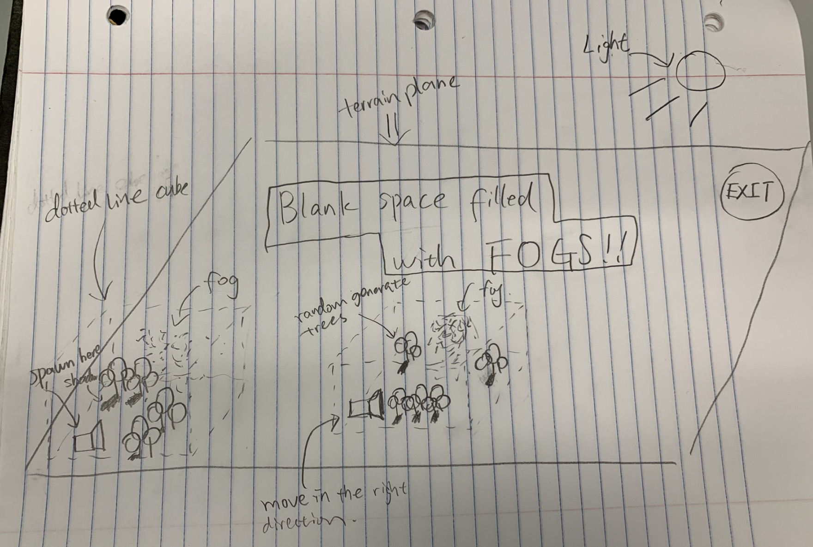
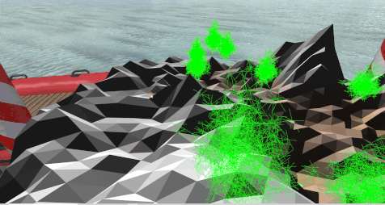

# CSE 167 Final Project

## Project Name: Find Prof.Schulze

### Team Members:
Xu, Wei 
Wei, Zeng

### FINAL VIDEO LINK:
https://www.youtube.com/watch?v=pxeK5F5O6KI

### Project Description:
We plan to implement a foggy escape game with randomly generated trees and terrains. Our game starts with placing the player at a random position in our scene and the goal of the player is to find the photo of Prof.Schulze. As player moves around the terrain, the trees surrounding him will be randomly generated and the player will need to find out the exit to clear the fog. If the player successfully find the photo of Prof.Schulze, we remove the fog and switch the whole scene to Toon Shading.

### Technical Points:

#### Easy
1. Toon Shading                                       (IMPLEMENTED)
2. Particle Effect                                    (DISCARDED)
3. First person camera                                (IMPLEMENTED)
4. Selection Buffer                                   (DISCARDED)
5. Collision detection with bounding spheres or boxes (DISCARDED)
6. Sound effects                                      (DISCARDED)

#### Medium
1. Procedurally generated Terrain                     (IMPLEMENTED)
2. Procedurally generated plants with L-systems       (IMPLEMENTED)
3. Shadow mapping                                     (DISCARDED)

### What's Creative:
The photo of Prof.Schulze is always underneath the player(:P).

### Sketching:

The boundaries of how far we randomly generate trees are defined by the dotted line cube surrounding our camera. As the camera moves, the cube moves with it so that every time we move to a new position on our terrain plane, we see trees with different shapes and at different spots. We don't render any trees outside the cube since the player would not be able to see very far due to the fog.

## Blog 2:

### Update
We realized that volumetric fog effect might be a little too complicated to implement with the given amount of time. Therefore we might just remove the fog effect or take an easier approach if time allows.

### - What we did last week
We prioritized some technical points such as the Procedurally generated terrain and plants, the Toon shading and the first person camera movement on the terrain. The Procedurally generated terrain was implement by Xu with the diamond square algorithm and the plants generation was implemented by Wei with the L-system. We successfully planted the trees onto the terrain and were able to control the player with the camera on the terrain simulating a walking effect. Toon Shading was also implemented and we could switch shadings.



## Blog 3:

### Update:
We removed a few technical points as marked above in the TP section. Also, we made so changes to the goal of the game and the creativity approach (check previous section). Now, the goal is to find the photo of Prof.Schulze! Rename the project to "Find Prof.Schulze".

### What we did last week:
During the last week of development, we finalized the features of our project. We used an easier approach to implement the fog effect and now we are able to toggle on and off the fog. The terrain plane of our world was also made smoother and the trees were also modified in shapes so that the environment looks better aesthetically. We also added the key to re-generate the terrain and the trees with the key "T". In addition, the key 'c' allows player to enter flying mode to see the entire terrain.


## Project Structure
```
.
├─deps                              # 3rd librarys to build
│  └─stb_image                      # https://github.com/nothings/stb
├─meshes                            # 3D models
├─shaders                           # GLSL shaders
├─src                               # Sources
│  ├─gl_wraps                       # C++ wrapper for OpenGL
│  ├─materials                      # Materials
│  └─objects                        # Scene graph
│      ├─animators                  # Animating nodes
│      ├─controls                   # User control
│      └─geometries                 # Geometry nodes
└─textures                          # Textures
```

## Build & Run
Use CMake to configure cross-platform build.
Run the executable in the repo `.` so that it can find the shaders/, meshes/, textures/.

## OpenGL Wrappers (src/gl_wraps)
- `gl.h` wrap OpenGL headers
- `GLObject` handle `glGen*`, `glDelete*`
- `GLContext` create window and initialize OpenGL context
- `Shader` compile, bind, use shaders
    - `Uniform<T>` set uniforms
- `GLBuffer` bind, upload buffers
- `GLVertexArray` bind vertex arrays, set vertex attributes
- `GLTexture` bind textures, set filter and wrap options
    - `TextureCubemap` Cubemap textures
    - `Texture2D` 2D textures

## Scene Graph (src/objects)
- `Node`: base class for node in the graph
    - `Transform` member for world-model transformation
    - `draw` draw the tree, `update` update the tree in game loop
    - graph is strict tree structure
        - `Group` is node that has child nodes
        - `addChild` another `Node` as child nodes
        - `parent` member to find its parent in the tree
        - `std::list<std::unique_ptr<Node>>` to store child nodes, raw pointers as handles to them
    - `cull` to cull object before rendering
    - tree structure can be deep copied
        - OpenGL objects are not copyable, use std::shared_ptr to share them
        - `clone` deep copy a std::unique_ptr of unknown type, must be implemented for each concrete class
- `Camera`: camera is node in the graph
- `Skybox`: skybox is also a node
- `controls/`: various nodes whose transform user can change, so its child nodes (e.g. camera) can be moved
    - `FreeFlying`: freely movable by W,A,S,D and mouse
- `geometries/`: various geometries like bezier curve, mesh, wireframe, robot
    - `Terrain` implements procedurally generated terrain with Diamond Square Algorithm
    - `PerlinNoiseTerrain` implements procedurally generated terrain with 2D Perlin Noise

## Window (src/Window.h)
- `loop`, `draw`, `update` handle game loop
- `initialize*` initialize shader and scene graph
- `*Callback` handle events

## Materials (src/materials)
- `Material` combines shaders, uniforms, encapsulates rendering techniques
